# ,Gazebo仿真

## 一、URDF创建

- 格式：

  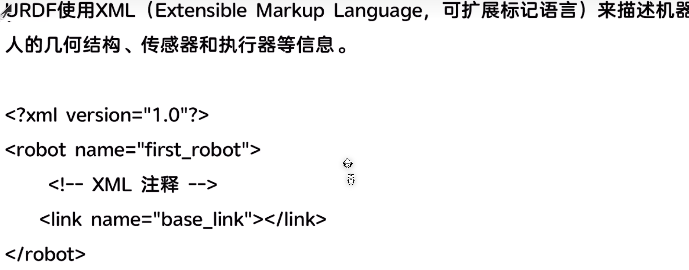

除了创建部件还有设定材质颜色等

- 编译命令：

  ```
  wybie@wenjun:~/chapt6/chapt6_ws/src/bot_descripthon/urdf$ urdf_to_graphviz first_robot.urdf
  ```

  

## 二、RViz显示

- 终端显示：

  ```
  rviz2
  ```

- 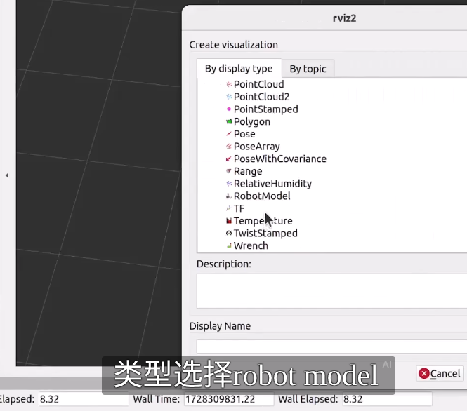

- 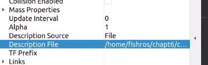

- 部位连接逻辑：

  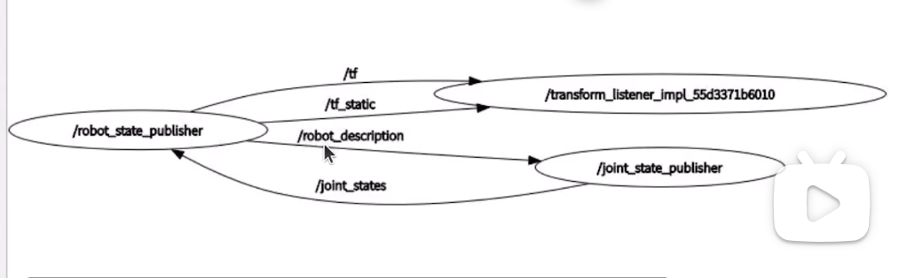

- 终端运行：
  1. `sudo apt install ros-$ROS_DISTRO-joint-state-publisher`
  2. `sudo apt install ros-$ROS_DISTRO-robot-state-publisher`

- cmakelists.txt:

  ```
  install (
    DIRECTORY urdf
    DESTINATION share/${PROJECT_NAME}
  )
  ```


- 添加launch文件：

  ```
  install(DIRECTORY launch
    DESTINATION share/${PROJECT_NAME}/
  )
  ```

- rviz配置操作：

  - 添加model文件
  - 添加describe topic
  - 添加status

  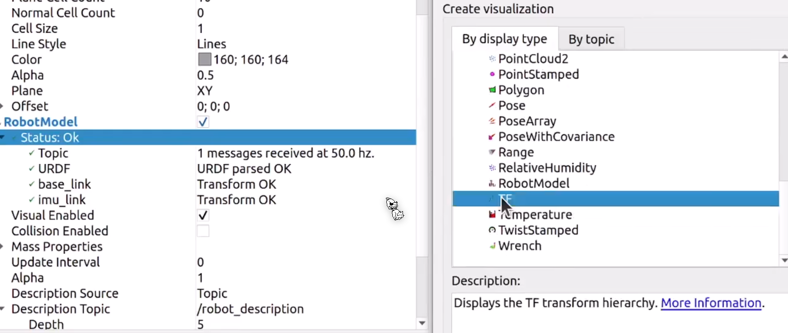

​			 添加文件

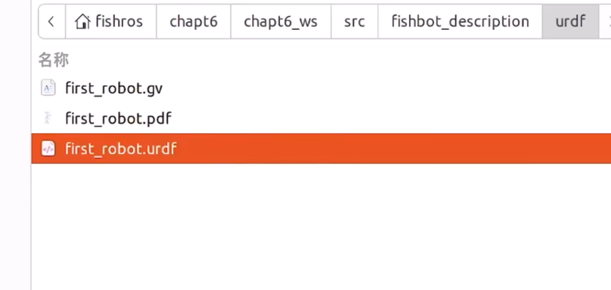

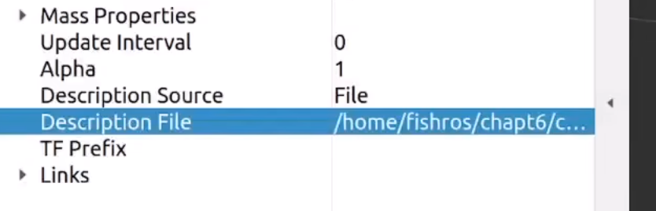

###### ✴rviz2疯狂频闪

启动前添加

```
export QT_ENABLE_HIGHDPI_SCALING=0 
```

https://blog.csdn.net/qq_53044655/article/details/141371346

`export QT_ENABLE_HIGHDPI_SCALING=0` 是一个环境变量设置命令，它的作用是：

**功能解释**：

- 禁用Qt框架的高DPI（高分辨率屏幕）自动缩放功能
- 强制Qt应用程序以原始像素尺寸渲染，不进行任何缩放调整

###### ✴注意urdf格式

拼写，嵌套结构，参数

- 修改urdf参数

  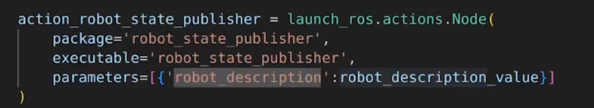

在ROS 2系统中启动 `robot_state_publisher` 节点，并将包含机器人URDF模型描述的参数传递给该节点，以便它能够正确地发布机器人的状态信息，为后续的机器人控制和可视化等操作提供基础数据。

```
ros2 run rviz2 rviz2 --ros-args -p xx:xxx
```

修改后传递不同的urdf文件

## 三、Xacro简化

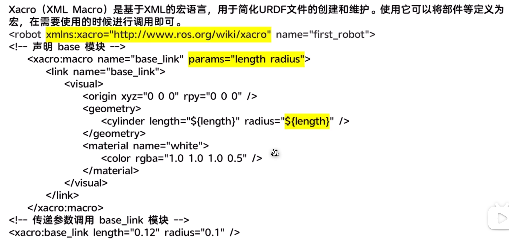

- 转urdf

  ```
  xacro <xacro_path>
  ```

###### ✴</xacro>它应为显式关闭，杠号在前

```
ros2 launch bot_descripthon launch.py model:=/home/wybie/simulation/chapt6_ws/src/bot_descripthon/urdf/wybiebot/first_robot.urdf.xacro
```

###### ✴检查xacro

```
wybie@wenjun:~/chapt6/chapt6_ws$ xacro ~/chapt6/chapt6_ws/src/bot_descripthon/urdf/first_robot.xacro > /tmp/out.urdf
wybie@wenjun:~/chapt6/chapt6_ws$ check_urdf /tmp/out.urdf
```

❗一旦你修改了 Python launch 文件，要重新 build + source：

```
cd ~/chapt6/chapt6_ws
colcon build
source install/setup.bash
```

## 四、添加物理属性

- 碰撞

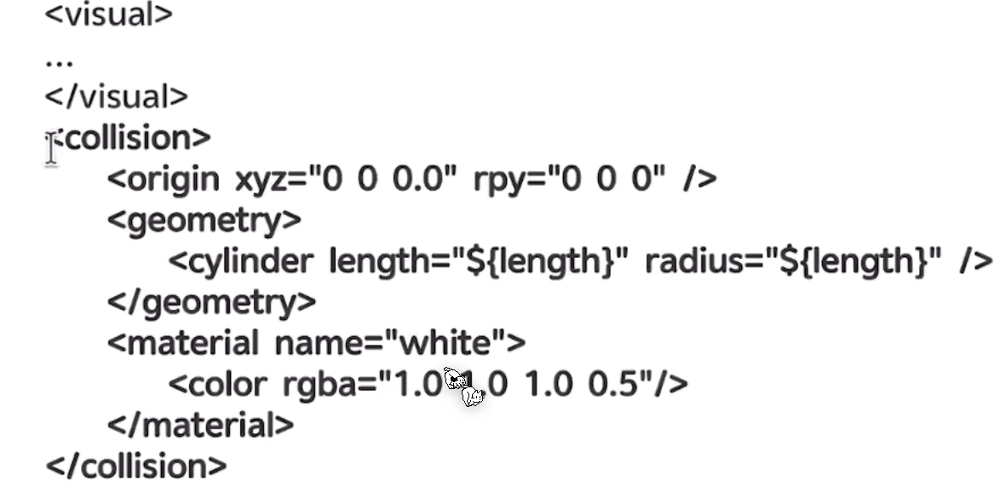

- 惯性

    ```
    - <?xml version="1.0"?>
      <robot xmlns:xacro="http://ros.org/wiki/xacro">
          <xacro:macro name="box_inertia" params="m w h d">
              <inertial>
                  <mass value="${m}" />
                  <inertia ixx="${(m/12) * (h*h + d*d)}" ixy="0.0" ixz="0.0" iyy="${(m/12) * (w*w + d*d)}" iyz="0.0" izz="${(m/12) * (w*w + h*h)}" />
              </inertial>
          </xacro:macro>
      <xacro:macro name="cylinder_inertia" params="m r h">
          <inertial>
              <mass value="${m}" />
              <inertia ixx="${(m/12) * (3*r*r + h*h)}" ixy="0" ixz="0" iyy="${(m/12) * (3*r*r + h*h)}" iyz="0" izz="${(m/2) * (r*r)}" />
          </inertial>
      </xacro:macro>
    
      <xacro:macro name="sphere_inertia" params="m r">
          <inertial>
              <mass value="${m}" />
              <inertia ixx="${(2/5) * m * (r*r)}" ixy="0.0" ixz="0.0" iyy="${(2/5) * m * (r*r)}" iyz="0.0" izz="${(2/5) * m * (r*r)}" />
          </inertial>
      </xacro:macro>
      </robot>
    
    
    ```

## 五、在gazebo中加载模型

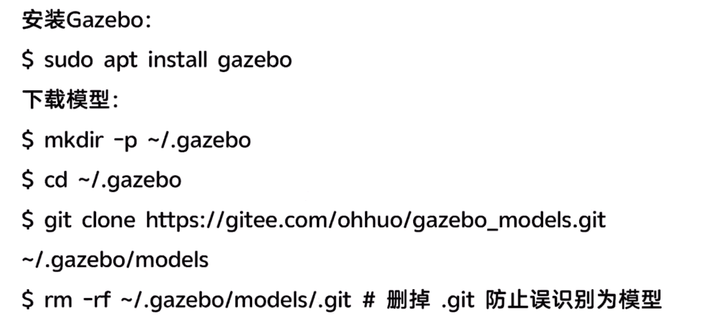

- 将world文件转为urdf

`sudo apt install ros-$ROS_DISTRO-gazebo-ros-pkgs`

- 标签转换不全

  ```
  <xacro:macro name="laser_xacro" params="xyz">
      <gazebo reference="laser_cylinder_link">
          <material>Gazebo/Black</material>
      </gazebo>
      <gazebo reference="laser_link">
          <material>Gazebo/Black</material>
      </gazebo>
      ...
  </xacro:macro>
  ```

## 六、两轮差速控制

- **键盘控制：**

  `ros2 run teleop_twist_keyboard teleop_twist_keyboard`

```
<gazebo>
  <plugin name='diff_drive' filename='libgazebo_ros_diff_drive.so'>
    <ros>
      <namespace>/</namespace>
      <remapping>cmd_vel:=cmd_vel</remapping>
      <remapping>odom:=odom</remapping>
    </ros>
  </plugin>
</gazebo>
```

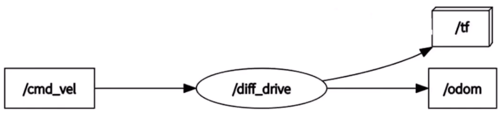

###### ✴键盘控制运动命令

```
ros2 run teleop_twist_keyboard teleop_twist_keyboard
```

###### ✴轮子转动方向踩坑：

- **左轮**应该按 Y 正方向转
- **右轮**应该按 Y **负**方向转（绕 Y 负方向旋转才是“正向前进”）

## 七、仿真插件

- laser.urdf.xacro:

  ```
    <xacro:macro name="laser_xacro" params="xyz">
      <!-- Gazebo 材质参考 -->
      <gazebo reference="laser_cylinder_link">
        <material>Gazebo/Black</material>
      </gazebo>
      <gazebo reference="laser_link">
        <material>Gazebo/Black</material>
      </gazebo>
  
      <!-- ============雷达支撑杆================ -->
      <link name="laser_cylinder_link">
        <visual>
          <origin xyz="0 0 0" rpy="0 0 0"/>
          <geometry>
            <cylinder length="0.10" radius="0.01"/>
          </geometry>
          <material name="black">
            <color rgba="0.0 0.0 0.0 0.8"/>
          </material>
        </visual>
        <collision>
          <origin xyz="0 0 0" rpy="0 0 0"/>
          <geometry>
            <cylinder length="0.10" radius="0.01"/>
          </geometry>
        </collision>
        <!-- inertia 可选 -->
        <xacro:cylinder_inertia m="0.01" r="0.01" h="0.10" />
      </link>
  
      <joint name="laser_cylinder_joint" type="fixed">
        <parent link="base_link"/>
        <child link="laser_cylinder_link"/>
        <origin xyz="${xyz}" rpy="0 0 0"/>
      </joint>
  
      <!-- ============雷达本体================ -->
      <link name="laser_link">
        <visual>
          <origin xyz="0 0 0" rpy="0 0 0"/>
          <geometry>
            <cylinder length="0.02" radius="0.02"/>
          </geometry>
          <material name="black">
            <color rgba="0.0 0.0 0.0 0.8"/>
          </material>
        </visual>
        <collision>
          <origin xyz="0 0 0" rpy="0 0 0"/>
          <geometry>
            <cylinder length="0.02" radius="0.02"/>
          </geometry>
        </collision>
        <!-- inertia 可选 -->
      <xacro:cylinder_inertia m="0.03" r="0.02" h="0.02" />
      </link>
  
      <joint name="laser_joint" type="fixed">
        <parent link="laser_cylinder_link"/>
        <child link="laser_link"/>
        <origin xyz="0 0 0.05" rpy="0 0 0"/>
      </joint>
  
      <gazebo reference="laser_link">
        <sensor type="ray" name="laser_sensor">
          <visualize>true</visualize>
          <update_rate>10</update_rate>
          <ray>
            <scan>
              <horizontal>
                <samples>360</samples>
                <resolution>1</resolution>
                <min_angle>-1.5708</min_angle>
                <max_angle>1.5708</max_angle>
              </horizontal>
            </scan>
            <range>
              <min>0.02</min>
              <max>10.0</max>
            </range>
          </ray>
        </sensor>
      </gazebo>
    </xacro:macro>
  
  </robot>
  ```

  

```
<?xml version="1.0"?>
<robot xmlns:xacro="http://www.ros.org/wiki/xacro">
    <xacro:macro name="gazebo_sensor_plugin">
        <gazebo reference="laser_link">
            <sensor name="laserscan" type="ray">
                <plugin name="laserscan" filename="libgazebo_ros_ray_sensor.so">
                    <ros>
                        <namespace>/</namespace>
                        <remapping>~/out:=scan</remapping>
                    </ros>
                    <output_type>sensor_msgs/LaserScan</output_type>
                    <frame_name>laser_link</frame_name>
                </plugin>
                <always_on>true</always_on>
                <visualize>true</visualize>
                <update_rate>5</update_rate>
                <pose>0 0 0 0 0 0</pose>
								<!-- 激光传感器配置 -->
                <ray>
                    <!-- 设置扫描范围 -->
                    <scan>
                        <horizontal>
                            <samples>360</samples>
                            <resolution>1.000000</resolution>
                            <min_angle>0.000000</min_angle>
                            <max_angle>6.280000</max_angle>
                        </horizontal>
                    </scan>
                    <!-- 设置扫描距离 -->
                    <range>
                        <min>0.120000</min>
                        <max>8.0</max>
                        <resolution>0.015000</resolution>
                    </range>
                    <!-- 设置噪声 -->
                    <noise>
                        <type>gaussian</type>
                        <mean>0.0</mean>
                        <stddev>0.01</stddev>
                    </noise>
                </ray>
            </sensor>
        </gazebo>

        

<gazebo reference="imu_link">
    <sensor name="imu_sensor" type="imu">
        <plugin name="imu_plugin" filename="libgazebo_ros_imu_sensor.so">
            <ros>
                <namespace>/</namespace>
                <remapping>~/out:=imu</remapping>
            </ros>
            <initial_orientation_as_reference>false</initial_orientation_as_reference>
        </plugin>
        <update_rate>100</update_rate>
        <always_on>true</always_on>
        <!-- 六轴噪声设置 -->
        <imu>
            <angular_velocity>
                <x>
                    <noise type="gaussian">
                        <mean>0.0</mean>
                        <stddev>2e-4</stddev>
                        <bias_mean>0.0000075</bias_mean>
                        <bias_stddev>0.0000008</bias_stddev>
                    </noise>
                </x>
                <y>
                    <noise type="gaussian">
                        <mean>0.0</mean>
                        <stddev>2e-4</stddev>
                        <bias_mean>0.0000075</bias_mean>
                        <bias_stddev>0.0000008</bias_stddev>
                    </noise>
                </y>
                <z>
                    <noise type="gaussian">
                        <mean>0.0</mean>
                        <stddev>2e-4</stddev>
                        <bias_mean>0.0000075</bias_mean>
                        <bias_stddev>0.0000008</bias_stddev>
                    </noise>
                </z>
            </angular_velocity>
            <linear_acceleration>
                <x>
                    <noise type="gaussian">
                        <mean>0.0</mean>
                        <stddev>1.7e-2</stddev>
                        <bias_mean>0.1</bias_mean>
                        <bias_stddev>0.001</bias_stddev>
                    </noise>
                </x>
                <y>
                    <noise type="gaussian">
                        <mean>0.0</mean>
                        <stddev>1.7e-2</stddev>
                        <bias_mean>0.1</bias_mean>
                        <bias_stddev>0.001</bias_stddev>
                    </noise>
                </y>
                <z>
                    <noise type="gaussian">
                        <mean>0.0</mean>
                        <stddev>1.7e-2</stddev>
                        <bias_mean>0.1</bias_mean>
                        <bias_stddev>0.001</bias_stddev>
                    </noise>
                </z>
            </linear_acceleration>
        </imu>
    </sensor>
</gazebo>

    </xacro:macro>


<gazebo reference="camera_link">
    <sensor type="depth" name="camera_sensor">
        <plugin name="depth_camera" filename="libgazebo_ros_camera.so">
            <frame_name>camera_optical_link</frame_name>
        </plugin>
        <always_on>true</always_on>
        <update_rate>10</update_rate>
        <camera name="camera">
            <horizontal_fov>1.5009831567</horizontal_fov>
            <image>
                <width>800</width>
                <height>600</height>
                <format>R8G8B8</format>
            </image>
            <distortion>
                <k1>0.0</k1>
                <k2>0.0</k2>
                <k3>0.0</k3>
                <p1>0.0</p1>
                <p2>0.0</p2>
                <center>0.5 0.5</center>
            </distortion>
        </camera>
    </sensor>
</gazebo>


</robot>
```

- 插件应用流程：

  在sensor中编写模型的.urdf.xacro->在plugins中编写激光雷达的配置和ros2的话题发布->在robot.urdf.xacro中引用模型链接并调用插件

- **ignition gazebo和经典Gazebo**

  | 经典 Gazebo |    Ignition Gazebo    | 经典Gazebo                  |
  | :---------: | :-------------------: | --------------------------- |
  |  界面风格   |   较传统，功能稳定    | 更现代，模块化 GUI          |
  |  启动方式   | `gazebo <world_file>` | `ign gazebo <world_file>`   |
  |  文件格式   | `.world` (基于旧 SDF) | `.sdf` (基于 SDFormat 1.6+) |
  |  插件开发   |    较传统 C++ API     | 更现代的插件和组件接口      |

  ignition gazebo内部的话题需要桥接器转换到ros2

  ```
  ros2 run ros_gz_bridge parameter_bridge /laser_scan@sensor_msgs/msg/LaserScan@gz.msgs.LaserScan
  ```

- 用这个检查ros2话题但可以看到它的来源，因为有时候文件里会定义很多节点

  ```
  ros2 topic list -t
  ```

- 应用控制器时：

  先加载控制器`ros2 control load_controller wybiebot_joint_state_broadcaster`

  激活控制器`ros2 control load_controller wybiebot_joint_state_broadcaster --set-state active`

  日志查看命令`journalctl -xe | grep controller_manager`

  控制器查询命令 `ros2 control list_controllers`

- 控制行进命令：`ros2 topic pub /cmd_vel geometry_msgs/msg/Twist "{linear: {x: 0.1}, angular: {z: 0.2}}"`

- 硬件接口查询：`ros2 control list_hardware_interfaces`

## 八、control驱动

目的为简化硬件集成

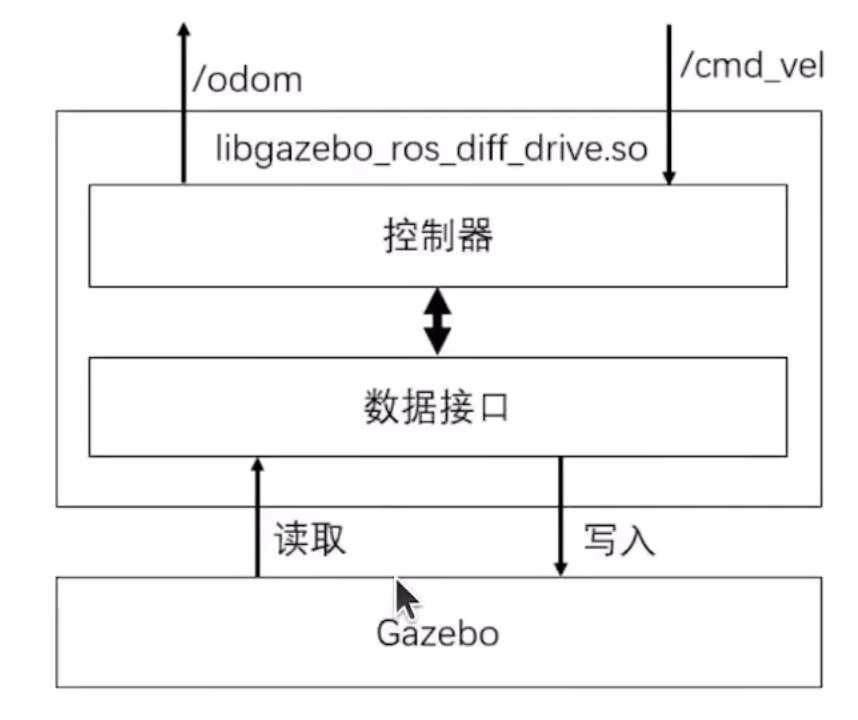

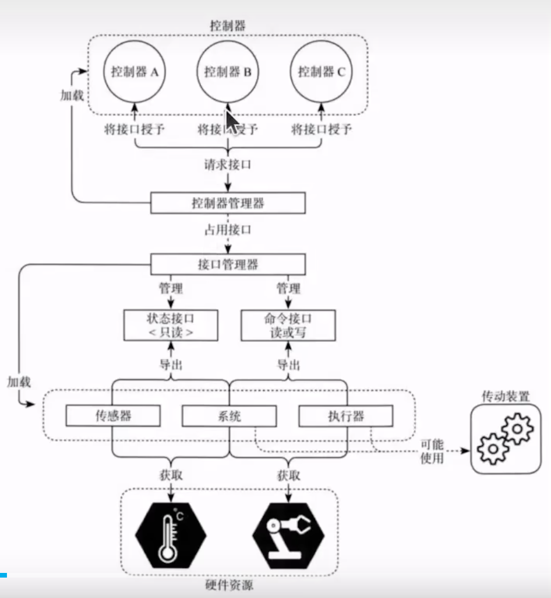

`sudo apt install ros-$ROS_DISTRO-ros2-control`

`sudo apt install ros-$ROS_DISTRO-ros2-controllers`

`sudo apt install ros-$ROS_DISTRO-gazebo-ros2-control`

- 加载并激活

  `ros2 control load_controller fishbot_joint_state_broadcaster_ --set-state active`

- 力控制器

  ```
  controller_manager:
    ros__parameters:
      ...
    fishbot_effort_controller:
      type: effort_controllers/JointGroupEffortController
  ```

  

```
wybiebot_joint_state_broadcaster[active]
wybiebot_effort_controller[unconfigured]
wybiebot_diff_drive_controller[unconfigured]
```

## 如何改造你的节点以适配仿真相机？

### 关键点：

- **用`image_transport`订阅相机话题**，接收仿真相机的图像。
- 用`cv_bridge`将ROS2图像消息转换成OpenCV的Mat。
- 替换`cv::VideoCapture`打开真实摄像头的代码，改成订阅回调。
- 推理过程不变，只是从回调里拿到每一帧图像进行推理。
- 依然把结果用`geometry_msgs::msg::Point`发布。

**什么是mat？**

https://blog.csdn.net/guyuealian/article/details/70159660 

## 基础导航

###### ✴查看tf树

```
ros2 run tf2_tools view_frames
```

- **同步定位和地图构建介绍：**

  odem中雷达和里程计有噪声误差，slam技术 结合特征提取和滤波算法可识别去除

- 代价信息：计算路径时遇到的障碍物

- 脱困行为：遇到障碍时解决问题的方法

## 一、构建导航地图

```
sudo apt install ros-$ROS_DISTRO-slam-toolbox
ros2 launch slam_toolbox online_async_launch.py use_sim_time:=True
```

**use_sim_time:=True？**因为激光雷达时间戳和仿真时间戳可能不一致，用这个方式让激光雷达应用仿真的时间戳，不然的话雷达话题不会发布数据；如果发现雷达已经用了仿真时间但还是接收不到数据，则有可能是TF变化时间并未与仿真时间对齐

```
ros2 run tf2_ros static_transform_publisher 0.0 0.0 0.0 0.0 0.0 0.0 map base_laser_link  														ros2 param set /<node_name> use_sim_time true 		ros2 bag play -l --clock XXX.bag
```

**queue is full?**经典的tf错误，打开`rqt`查看tf树

或使用tftool2工具

`ros2 run tf2_tools view_frames`

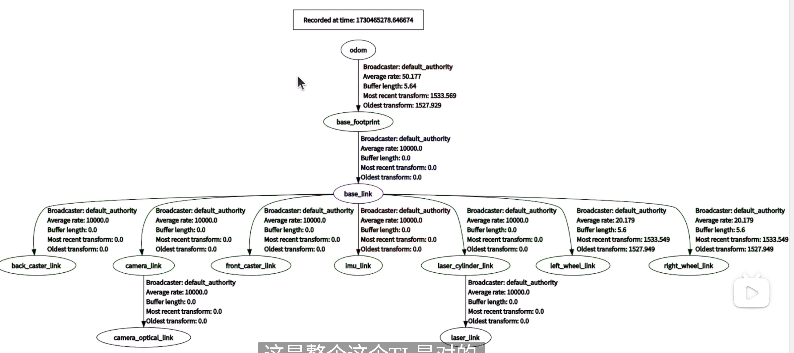

这样是不对的，map需要到odem有一个坐标转换，若没有，可能就是slambox没有真正启动，目前我的问题是：还没开始发布 `map → odom`

最后终于解决了，是因为slam技术没有从自定义.yaml文件启动，正确的启动方式应该是

```
ros2 launch slam_toolbox online_async_launch.py use_sim_time:=True \
  slam_params_file:=/home/wybie/ros2bookcode-master/chapt7/chapt7_ws/src/fishbot_description/config/slam_config.yaml \
  log_level:=debug
```

/home/wybie/ros2bookcode-master/chapt7/chapt7_ws/src/fishbot_description/config/slam_config.yaml

```
slam_toolbox:
  ros__parameters:
    use_sim_time: true             # 如果你在仿真或 rosbag 播放中，设置为 true
    slam_mode: true                # true 表示运行 SLAM；false 表示纯定位模式
    resolution: 0.05               # 地图分辨率，单位：米
    map_update_interval: 2.0       # 更新频率（单位：秒）
    max_laser_range: 20.0          # 激光最大距离，根据你雷达而定

    # 坐标系名称
    odom_frame: "odom"
    map_frame: "map"
    base_frame: "base_link"

    # 激光话题
    scan_topic: "/scan1"

    # 发布 TF
    publish_tf: true
    map_publish_period: 1.0

    # 其它参数（可以保持默认）
    minimum_time_interval: 0.5
    transform_publish_period: 0.05
    enable_interactive_mode: false
    use_scan_matching: true
```

- **将地图保存为文件：**

  ```
  sudo apt install ros-$ROS_DISTRO-nav2-map-server
  mkdir /maps(bot_navigation2路径中)
  ros2 run nav2_map_server map_saver_cli -f room
  ```

  ###### ✴建图建歪了？

  https://blog.csdn.net/qq_39032096/article/details/121389652

  关掉slam重建，把速度调的很小很小

  ###### ✴为什么需要校准里程计？

  1. **误差累积**
      里程计通常基于轮速计或编码器，测量车轮旋转来估算机器人运动距离和方向。轮胎打滑、地面不平、轮子直径不精确、轮距测量误差等，都会导致距离计算不准，这些误差会随着时间不断累积，最终导致机器人“漂移”或“跑偏”。
  2. **非理想运动模型**
      机器人在实际运动时，不一定严格按照理想的差速轮模型运动，比如轮胎滑动、转弯半径变化，这些都会使里程计的模型不精确。
  3. **硬件差异和安装偏差**
      车轮安装不完全对称，编码器计数不精准，机械结构轻微偏差，都会影响里程计读数。
  4. **环境因素**
      地面摩擦力不同、障碍物影响、机器人载重变化都会改变实际运动轨迹。

## 二、Navigation 2

✴导航功能建立在地图文件上

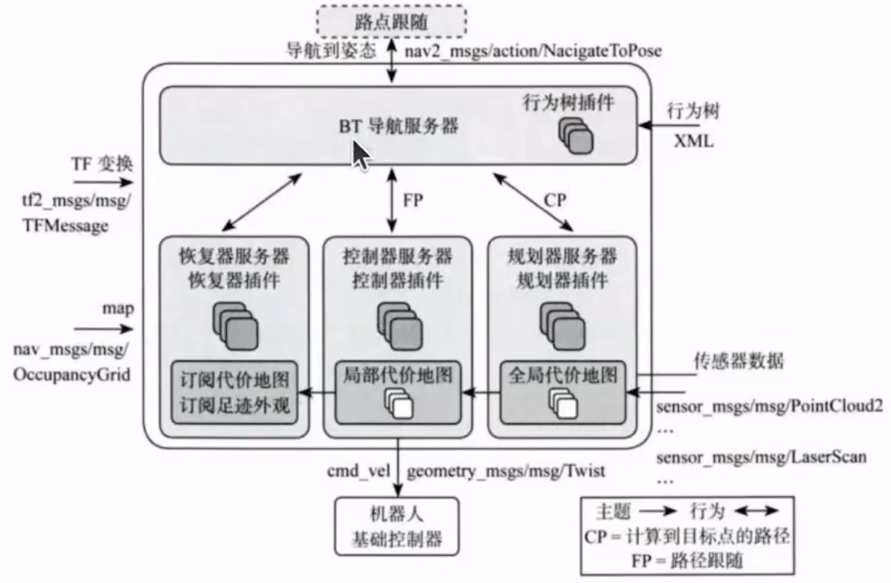

安装命令：

```
sudo apt install ros-$ROS_DISTRO-navigation2
sudo apt install ros-$ROS_DISTRO-nav2-bringup
```

参数配置：

文件在`nav2_params.yaml`中可以查看配置和代偿地图；frame表示的一般都是tf坐标

```
cp /opt/ros/$ROS_DISTRO/share/nav2_bringup/params/nav2_params.yaml src/fishbot_navigation2/config
```

- 优化导航速度和膨胀路径：

  ```
  global_costmap
  ```

- 话题初始化机器人位姿：

  ```
  ros2 node info /amcl
  ros2 topic pub /initialpose geometry_msgs/msg/PoseWithCovarianceStamped "{header: {frame_id: map}, pose: { pose: {position: { x: 0.0, y: 0.0, z: 0.0}}}}" --once
  ```

- - 查看动作接口

    ```
    ros2 action list -t
    ```

  - 查看接口类型

    ```
    ros2 interface show nav2_msgs/action/NavigateToPose[节点后的消息空间]
    ```

  - 接口发布消息类型  注:由于接口设置不同，故反馈值也不同

    ```
    ros2 action send_goal /navigate_to_pose[消息类型] nav2_msgs/action/NavigateToPose[消息空间] "{pose: {header: {frame_id: map}, pose: {position: {x: 2.0, y: 1.0}}}}"[按照内容发布] --feedback
    ```

​	**什么是AMSL？**

​		它是 ROS 中用于 **在已知地图中实现机器人自主定位（Localization）** 的一个 **概率滤波		算法包**，基于 **蒙特卡罗定位（MCL, Monte Carlo Localization）** 方法，并加入了 **自		适应机制** 来提高效率和精度。

- 创建bot_application功能包

  ```
  ros2 pkg create fishbot_application --build-type ament_python --license Apache-2.0
  ```


- 使用TF获取机器人实时位置

  ```
  amcl:
  ros__parameters:
  base_frame_id: "base_footprint"
  global_frame_id: "map"
  odom_frame_id: "odom"
  tf_broadcast: true
  ...
  ```

- 调用接口进行单点导航

  ```
  ros2 action list -t
  
  /assisted_teleop
  /backup
  /compute_path_through_poses
  /compute_path_to_pose
  /drive_on_heading
  /follow_path
  /follow_waypoints
  /navigate_through_poses
  /navigate_to_pose
  /smooth_path
  /spin
  /wait
  ```

  调用接口进行路点导航：即设置经过多个点

  ```
  $ ros2 action info /follow_waypoints -t
  ---
  Action: /follow_waypoints
  Action clients: 2
  /rviz2 [nav2_msgs/action/FollowWaypoints]
  /rviz2 [nav2_msgs/action/FollowWaypoints]
  Action servers: 1
  /waypoint_follower [nav2_msgs/action/FollowWaypoints]
  ```

- 机器人系统架构设计

  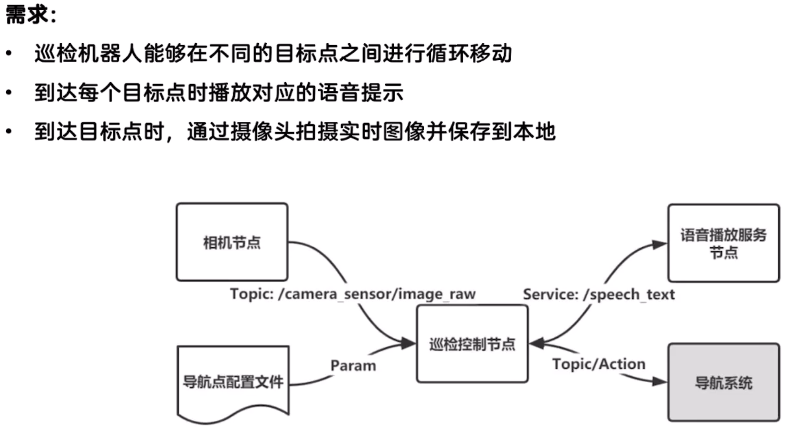

- 自动生成参数文件

  ```
  source install/setup.bash
  ros2 run autopartol_robot partol_node
  (新终端)
  ros2 param dump /partol_node
  ros2 node list/ros2 param list  #检查
  ```

  复制`ros2 param list`的内容到config下的`partol_config.yaml`，记得改成.yaml的格式-->`:`后改为`[ , , , ]`

- 执行文件并传入参数

  ```
  ros2 run autopartol_robot partol_node --ros-args --params-file /home/fishros/chapt7/chapt7_ws/install/autopartol_robot/share/autopartol_robot/config/partol_config.yaml
  ```

​		然后就会开始循环导航了

## 三、语音播报

```
string text  # 合成文字
---
bool result  # 合成结果

def speak_text_callback(self, request, response):
    self.get_logger().info('正在朗读 %s' % request.text)
    self.speaker.say(request.text)
    self.speaker.wait()
    response.result = True
    return response
```

- cmakelist对通信接口的声明

  ```
  rosidl_generate_interfaces(${PROJECT_NAME}
    "srv/SpeechText.srv"
  )
  ```

​		package对接口的声明		

```
<member_of_group>rosidl_interface_packages</member_of_group>
```

## 四、git托管

1. 进行初始化`git init`
2. 到目标包src下添加文件并检查状态`git add .`  `git status`
3. 发布指示`git commit -m "feat:初始化提交，完成巡检机器人"`

- 添加自描述文件(README.md)-->格式

  ```
  # 基于 ROS 2 和 Navigation 2 自动巡检机器人
  ## 1.项目介绍
  ## 2.使用方法
  ### 2.1安装依赖
  ### 2.2运行
  ## 3.作者
  ```

## 进阶导航

## 五、使用自己的规划器和导航器

- plublib:在ros2中编写自己的插件和动态加载和卸载插件的库

  ```
  sudo apt install ros-$ROS_DISTRO-pluginlib -y
  ```

  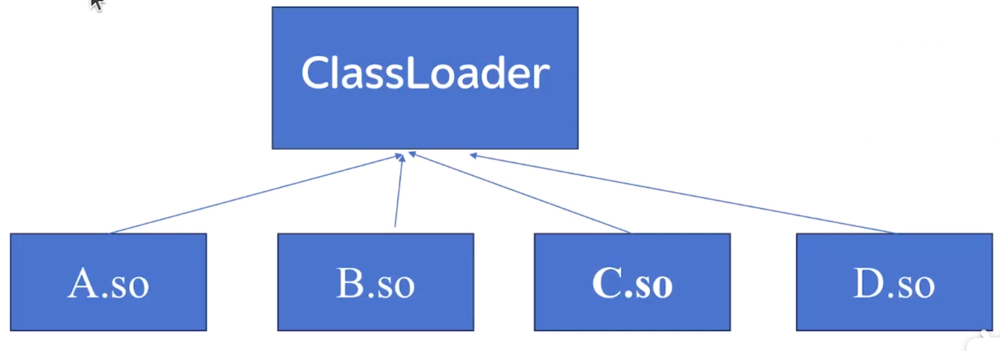

不同路径规划算法(执行文件)，对应不同的导航需求

## 六、插件

- 定义插件抽象类

  ```
  ros2 pkg create motion_control_system --dependencies pluginlib --license Apache-2.0
  ```

  ```
  #ifndef MOTION_CONTROL_INTERFACE_HPP
  #define MOTION_CONTROL_INTERFACE_HPP
  
  namespace motion_control_system {
  
  class MotionController {
  public:
      virtual void start() = 0;
      virtual void stop() = 0;
      virtual ~MotionController() {}
  };
  
  } // namespace motion_control_system
  
  #endif // MOTION_CONTROL_INTERFACE_HPP
  ```

头文件c语言格式的作用？防止在被多次调用时重定义

- 编写并生成第一个插件

  ```
  #ifndef SPIN_MOTION_CONTROLLER_HPP
  #define SPIN_MOTION_CONTROLLER_HPP
  
  #include "motion_control_system/motion_control_interface.hpp"
  
  namespace motion_control_system
  {
      class SpinMotionController : public MotionController
      {
      public:
          void start() override;
          void stop() override;
      };
  
  } // namespace motion_control_system
  
  #endif // SPIN_MOTION_CONTROLLER_HPP
  ```

- 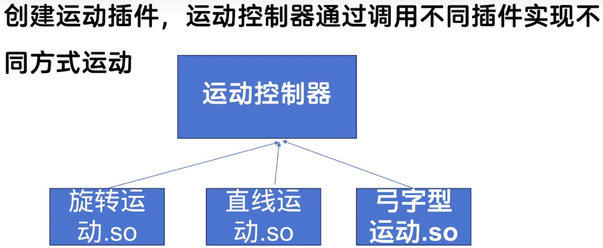

- cmake生成动态链接库？

  在 **CMake** 中，如果你想 **生成一个动态链接库（Dynamic Link Library，DLL / .so / .dylib）**，你需要使用 `add_library()`命令，并将库的类型指定为 **`SHARED`**
  
  命名上，前辍为lib,后辍为.so
  
- 查看链接库：

  跳到链接库父文件夹中输入命令`ldd`

## 七、自定义规划器

三个基本概念：位置，路径，占据栅格地图

```
ros2 interface show nav_msgs/msg/Path
ros2 interface show geometry_msgs/msg/PoseStamped
ros2 interface show nav_msgs/msg/OccupancyGrid
```

坐标转换

```
row_index = (y - info.origin.y) / info.resolution
col_index = (x - info.origin.x) / info.resolution
occupied_status = data[row_index * map_width + col_index]
```

意为仿真坐标减去偏移值，再除以分辨率


- 插值分辨率：路径规划中差值的密度，想要精度高就调小

- 配置导航参数：

  ```
  planner_server:
  ros__parameters:
  planner_plugins: ["GridBased"]
  use_sim_time: True
  GridBased:
  plugin: "nav2_custom_planner/CustomPlanner"
  interpolation_resolution: 0.1
  ```

规划器插件由规划服务器fin server进行调用

## 八、自定义导航控制器

 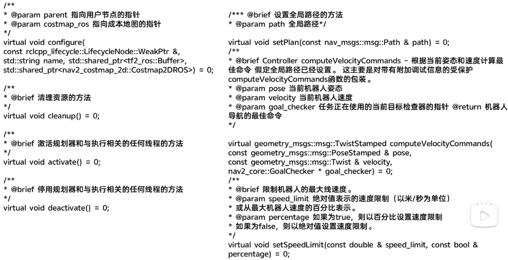

定义消息类型将数据封装发送

- 搭建控制器框架

  ```
  <class_libraries>
    <library path="nav2_custom_controller_plugin">
      <class type="nav2_custom_controller::CustomController" base_class_type="nav2_core::Controller">
        <description>
          自定义导航控制器
        </description>
      </class>
    </library>
  </class_libraries>
  ```

  创建功能包-->注意依赖

  ```
  ros2 pkg create nav2_custom_controller --build-type ament_cmake -dependencies pluginlib nav2_core
  ```

  \#plugin的Type中可通过/或：：直接命名，故.xml文件中可以直接使用

  cmake中添加库

  ```
  # 包含头文件目录
  include_directories(include)
  # 定义库名称
  set(library_name ${PROJECT_NAME}_plugin)
  # 创建共享库
  add_library(${library_name} SHARED src/custom_controller.cpp)
  # 指定库的依赖关系
  ament_target_dependencies(${library_name} nav2_core pluginlib)
  # 安装库文件到指定目录
  install(TARGETS ${library_name}
    ARCHIVE DESTINATION lib
    LIBRARY DESTINATION lib
    RUNTIME DESTINATION lib/${PROJECT_NAME}
  )
  # 安装头文件到指定目录
  install(DIRECTORY include/
    DESTINATION include/)
  # 导出插件描述文件
  pluginlib_export_plugin_description_file(nav2_core nav2_custom_controller.xml)
  ```

  package.xml

  ```
  <nav2_core plugin="${prefix}/custom_planner_plugin.xml" />
  ```

- 自定义控制算法

  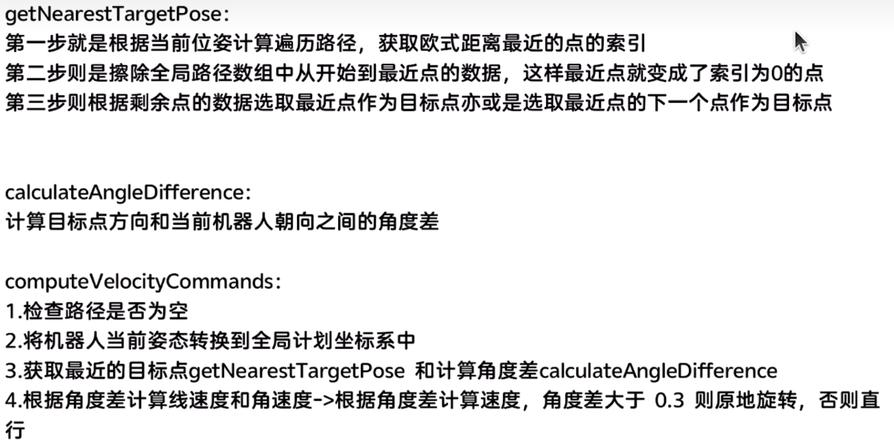

- 配置导航参数并测试

  ```
  controller_server:
    ros__parameters:
      use_sim_time: True
      ...
    FollowPath:
      plugin: "nav2_custom_controller::CustomController"
      max_linear_speed: 0.1
      max_angular_speed: 1.0
  ```

  

## 扫盲

- **什么是cnn和rnn？(适于动 态定位的算法)**

| 对比项       | CNN                      | RNN                      |
| ------------ | ------------------------ | ------------------------ |
| 数据类型     | 图像、视频               | 序列、文本、语音         |
| 是否有记忆   | 否                       | 是                       |
| 特征处理方式 | 空间特征（如局部图像块） | 时间特征（前后数据依赖） |
| 常见应用场景 | 图像分类、检测、分割等   | 语言建模、翻译、语音识别 |

- 路径规划算法类型：

  https://zhuanlan.zhihu.com/p/674095744		

- **什么是pcl和pcd？**

PCL 是一个**开源的点云处理库**，用于处理从 3D 传感器（如激光雷达、RGB-D 相机）获取的点云数据。PCD 是 PCL 定义的一种**标准点云数据文件格式**（类似于图像的 PNG/JPG）。

- **什么是setup.py？**

`setup.py` 是 Python 包的安装配置文件，用于通过 `setuptools` 构建和安装 Python 项目。如果你希望它**包含多个 Python 文件的主函数并可执行**，一般是通过 `entry_points` 来定义多个命令行可执行脚本。

- **为什么机器人的角度总是小数？**

因为角度都是弧度转数字，比如1.57=90度  