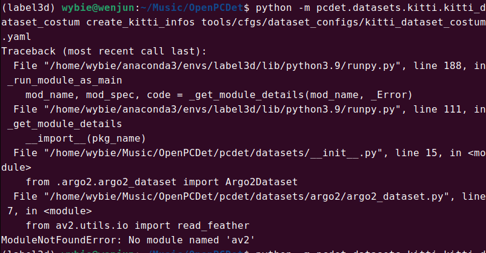
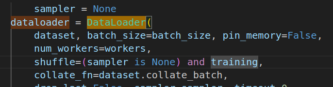

# OPENPCDet

以下提出一些跑代码遇到的问题

- **环境**

- **报错：**


- **原因：**

Conda 生态里很多包是预编译（binary package）。
 这些包在 Linux 上必须用一个固定版本的 gcc ABI 才能兼容。

如果 conda 不强制使用自己提供的“兼容编译器”，用户系统的 gcc 不同版本会导致：

- ABI 不兼容
- 符号找不到
- GLIBCXX_3.4.xx 找不到
- ImportError: undefined symbol

因此，conda环境第一个调用的是自己的fake gcc编译器，版本在12以上

- **解决：**

改一下环境变量

```
sudo gedit ~/.bashrc
添加以下
###
export CUDAHOSTCXX=/usr/bin/g++-11
export CC=/usr/bin/gcc-11
export CXX=/usr/bin/g++-11
###
. ~/.bashrc
```

### **下载依赖**

1. 确保你有conda和cuda,视觉环境装配中有教程

2. 创建conda隔离环境

   ```
   conda create -n label3d python=3.9
   conda activate label3d
   ```

3. 下载对应pytorch

   ```
   pip install numpy==1.26.4 --force-reinstall
   ```

   ```
   # 对应 CUDA 11.8
   conda install pytorch==2.2.2 torchvision==0.17.2 torchaudio==2.2.2 pytorch-cuda=11.8 -c pytorch -c nvidia
   
   pip3 install --user "numpy==1.23.5"
   ```

4. 下载依赖

   ```
   # 对应 CUDA 11.8
   pip install spconv-cu118
   ```

   修改requirement.txt第一个numpy改成numpy>=1.23,<2，然后

   ```
   pip install -r requirements.txt
   ```

5. 下载pcdnet

   ```
   sudo gedit ~/.bashrc
   添加以下
   ###
   export CUDAHOSTCXX=/usr/bin/g++-11
   export CC=/usr/bin/gcc-11
   export CXX=/usr/bin/g++-11
   ###
   . ~/.bashrc
   pip install "setuptools<60" -U
   python setup.py develop
   python setup.py build_ext --inplace
   ```

- `setuptools < 60` 的作用只有一个：
   阻止 `setup.py develop` 被“偷偷改成 PEP517 隔离构建”。
  
- **缺少av**：到/home/wybie/Music/OpenPCDet/pcdet/datasets/__init__.py里面注释15和27行

  

## 模型

### **训练模型**

- **使用kitti：**

  进入网站https://www.cvlibs.net/datasets/kitti/eval_object.php

  注册下载

  

  或运行

  ```
  wget -c https://s3.eu-central-1.amazonaws.com/avg-kitti/data_object_velodyne.zip
   wget -c https://s3.eu-central-1.amazonaws.com/avg-kitti/data_object_image_2.zip
  ```

  另外两个小点的文件同理

  **注意**-->预留50G空间

  然后直接解压到kittti目录

  \```

  OpenPCDet

  ├── data

  │   ├── kitti

  │   │   │── ImageSets

  │   │   │── training

  │   │   │   ├──calib & velodyne & label_2 & image_2 & (可选: planes) & (可选: depth_2)

  │   │   │── testing

  │   │   │   ├──calib & velodyne & image_2

  \```

  \* 通过运行以下命令生成数据信息文件：

  \```python 

  python -m pcdet.datasets.kitti.kitti_dataset create_kitti_infos tools/cfgs/dataset_configs/kitti_dataset.yaml

  \```

  **如果报找不到模块**

  ```
  export LD_LIBRARY_PATH=$(python - << 'EOF'
  import torch, os
  print(os.path.join(os.path.dirname(torch.__file__), "lib"))
  EOF
  ):$LD_LIBRARY_PATH
  ```


- **模型训练命令**

  如果运行pointpillars，则输入以下命令
  python train.py --cfg_file cfgs/kitti_models/pointpillar.yaml
  如果运行pointrcnn，则输入以下命令
  python train.py --cfg_file cfgs/kitti_models/pointrcnn.yaml
  如果运行second，则输入以下命令
  python train.py --cfg_file cfgs/kitti_models/second.yaml

  训练报错解决
  训练过程中如果报以下相关错误：KeyError: ‘road_plane‘

  /home/pc/OpenPCDet/tools/cfgs/kitti_models/pointpillar.yaml
  /home/pc/OpenPCDet/tools/cfgs/dataset_configs/kitti_dataset.yaml

  则在以上两个文件中修改内容

  将此处的True修改为False
  参考：https://blog.csdn.net/xx_xb/article/details/146416870

- **损失函数可视化**

  ```
  tensorboard --logdir="/home/pc/OpenPCDet/output/kitti_models/pointrcnn/default/tensorboard"
  ```

- **测试命令**

  测试模型：

  python test.py --cfg_file ${CONFIG_FILE} --batch_size $​{BATCH_SIZE} --ckpt ${CKPT}

  ```
  python test.py --cfg_file ./cfgs/kitti_models/pointpillarback.yaml --ckpt ../checkpoints_office/pointpillar_7728.pth
  ```

  其中$​{CONFIG_FILE}是配置文件的路径，${BATCH_SIZE}是批处理大小，$​{CKPT}是检查点文件的路径。

  使用Tensorboard绘制性能曲线：

  python test.py --cfg_file ${CONFIG_FILE} --batch_size ${BATCH_SIZE} --eval_all

### **自定义数据集**

https://blog.csdn.net/qq_44703886/article/details/136608008

https://blog.csdn.net/xx_xb/article/details/146416870

## 代码

```
sudo apt install ros-humble-tf-transformations
```

- **ROS部署代码**

  如果在ros2上给代码部署模型用fast-lio不能可视化，转换点云数据文件报错Qos，可能是跟我一样的Qos不匹配

  - 在 DDS（ROS2 的通信中间件）中：

    Publisher 和 Subscriber 必须在 QoS 上达成一致，否则该通信路径在逻辑上是 不存在的

  - 核心维度：

    Reliability（可靠性）是对 系统对信息完整性的假设：

    BEST_EFFORT假设：数据是高频、可替代的，每一帧不是一个“必需样本”

    RELIABLE

    假设：每一帧都是系统状态的一部分，缺帧 = 状态不完整

    因此当必需样本转为非必需样本时，不能一起用

- json和txt标签的区别

  | 特性     | KITTI TXT                       | 自定义 JSON                        |
  | -------- | ------------------------------- | ---------------------------------- |
  | 原生     | 官方 KITTI                      | 用户自定义                         |
  | 面向     | 图像 + LiDAR                    | 纯 LiDAR 或任意 3D                 |
  | 数据内容 | 类别 + 2D bbox + 3D bbox + 旋转 | 类别 + 顶点 + 可拓展字段           |
  | 可扩展性 | 低                              | 高，可存任意信息                   |
  | 使用场景 | KITTI 官方数据集训练            | 自己采集或处理点云数据（无需图像） |

  **txt格式：**

  ```
  - type        = me
    truncated   = 1.0
    occluded    = 0
    alpha       = 0.0
    bbox        = -1 -1 -1 -1 
    h w l       = 0.4500 0.5710 0.3600
    x y z       = -0.3460 -0.2861 -0.0075
    ry          = 0.0000
  - 
  ```

  完整训练流程

  1. 生成 `train.txt`、`val.txt`（保证 sample_id_list 对应现有 `.bin` 文件）。

  2. 运行你贴的脚本，生成 infos（`kitti_infos_train.pkl`, `kitti_infos_val.pkl`）。

  3. 在 `kitti_dataset_lidar.yaml` 里：

     ```
     CLASS_NAMES: ['me']
     ```

  4. 确保 `DatasetTemplate.__len__` 已实现，或者在 `KittiDataset` 里实现 `__len__`。

  5. 运行训练脚本：

     ```
     cd tools
     # 继续训练更多轮次，并启用混合精度
     python train.py --cfg_file cfgs/kitti_models/pointpillar.yaml \
                     --ckpt output/kitti_models/pointpillar/default/ckpt/checkpoint_epoch_80.pth \
                     --epochs 160 \
                     --use_amp \
                     --ckpt_save_interval 10
     ```

- `np.array()` 主要用于创建 NumPy 数组

  **构建齐次变换矩阵**：

  ```
  python
  
  P2 = np.concatenate([calib.P2, np.array([[0., 0., 0., 1.]])], axis=0)
  ```

  这里 `np.array([[0., 0., 0., 1.]])` 创建了一个形状为 (1, 4) 的数组，目的是为了将原本 3x4 的投影矩阵 [P2](javascript:void(0)) 扩展成一个 4x4 的齐次坐标变换矩阵

  

- **json格式标签无法识别问题解决总结**

  在使用 OpenPCDet 处理 KITTI 数据集的过程中，我最初遇到模型只支持 TXT 标签格式，而我的数据是纯 LiDAR 且采用 JSON 标签。为此，我重写了 KittiDataset 类，使其完全支持 JSON 标签解析，包括从顶点计算 3D 目标的中心点、尺寸和旋转信息。同时，我修改了 get_infos 方法，使其可以统计点云中落入每个目标的点数，并生成适合训练的 gt_boxes_lidar。在调试过程中，我遇到了相对导入报错、Python 模块执行方式以及线程池中 JSON 数据解析异常等问题，通过调整 PYTHONPATH、使用绝对路径执行模块，并增加对缺失或格式异常 JSON 的处理，最终顺利生成了训练、验证和测试集的 infos 文件，实现了纯 LiDAR + JSON 标签的数据集准备流程。

  

  **点云识别box格式与类名不一致问题解决总结**

  首先对数据集配置文件（KittiDataset 的 YAML）进行了重点检查，主要核对了 CLASS_NAMES、POINT_CLOUD_RANGE、DATA_SPLIT 等关键参数是否与 LabelCloud 中导出的标注信息保持一致，以确保数据在加载阶段不会因类别名不匹配或点云范围裁剪而导致真实标注框被过滤。虽然数据能够正常进入训练流程，但在训练初期通过打印 batch_dict 发现 gt_boxes 的数量和分布存在异常，表现为部分样本中的标注框数量不稳定甚至与人工标注不一致。基于这一现象，进一步将排查重点转移到数据增强模块，尤其是 gt_sampling（Ground Truth Sampling）机制。由于 gt_sampling 会从数据库中随机拷贝并插入额外的目标框，若数据库类别、点云格式或标注尺度与当前自制数据集不完全匹配，容易对原始标注产生干扰，造成 gt_boxes 行为异常。通过分析 DISABLE_AUG_LIST 与 AUG_CONFIG_LIST 的执行逻辑，明确了数据增强是在数据加载阶段统一生效的，最终通过在配置中禁用 gt_sampling，成功排除了数据库采样对原始标注的影响，使 gt_boxes 与实际标注保持一致，从而保证了训练数据的正确性和可控性。

   

  **无限递归和数据批处理问题总结**

  这次问题的解决过程主要围绕着KITTI数据集类的递归调用和数据批处理问题展开。最初代码在[__getitem__](file:///home/wybie/expand_blk/radar/engine/OpenPCDet/pcdet/datasets/dataset.py#L119-L131)方法中调用[prepare_data](file:///home/wybie/expand_blk/radar/engine/OpenPCDet/pcdet/datasets/dataset.py#L157-L217)时引发了无限递归，因为[prepare_data](file:///home/wybie/expand_blk/radar/engine/OpenPCDet/pcdet/datasets/dataset.py#L157-L217)内部又会调用[__getitem__](file:///home/wybie/expand_blk/radar/engine/OpenPCDet/pcdet/datasets/dataset.py#L119-L131)形成循环依赖。通过分析错误堆栈，我们发现问题根源在于数据处理流程中的递归调用，以及标签数据类型不匹配（字符串vs整数索引）导致的批处理失败。最终解决方案是重写[__getitem__](file:///home/wybie/expand_blk/radar/engine/OpenPCDet/pcdet/datasets/dataset.py#L119-L131)方法，用自定义的[_process_data_without_recursion](file:///home/wybie/expand_blk/radar/engine/OpenPCDet/pcdet/datasets/kitti/kitti_dataset.py#L191-L229)函数替代原有的[prepare_data](file:///home/wybie/expand_blk/radar/engine/OpenPCDet/pcdet/datasets/dataset.py#L157-L217)调用，手动执行数据增强、点特征编码和体素化等处理步骤，同时正确处理标签数据类型转换，将类别名称映射为整数索引并确保`frame_id`为整数类型，从而彻底解决了递归调用和数据批处理的形状不一致问题，使PointPillar模型能够正常训练。

  

  **损失函数异常纠正总结**

  在模型训练初期，首先发现 PointPillar 网络的损失值出现明显异常：训练开始后 loss 极快下降至接近 0，并在后续迭代中长期维持在极小量级（约 1e-11），但在验证阶段模型预测结果为空，所有 recall 指标均为 0，平均预测目标数量也为 0。这一现象表明模型并未真正学习到有效的目标检测能力，而是存在训练流程或数据标注层面的严重问题。

  针对该异常，首先从网络结构与优化参数入手进行排查，确认模型配置文件、学习率调度策略以及损失函数本身均未被错误修改，排除了网络结构和训练超参数导致 loss 异常的可能性。随后将重点转移到数据集与标注格式上，通过 `check_dataset.py` 对训练样本进行检查，发现虽然点云数据能够正常读取，但 `gt_boxes` 在多数样本中为空，且 `gt_names` 字段缺失，导致模型在训练时几乎没有有效的正样本参与监督学习，从而出现“loss 极低但性能为零”的假收敛现象。

  进一步追溯数据流后，定位问题出现在自定义 KITTI 数据集解析过程中：在 `KittiDataset.__getitem__` 中，原始标注信息虽然存在，但类别名称未被正确映射为 OpenPCDet 所要求的类别索引格式，同时无效类别在过滤过程中被全部剔除，最终使得传入网络的数据中不包含任何合法的目标框。针对该问题，对数据集代码进行了修正，显式将 `gt_names` 从字符串类别映射为以 1 为起始的类别索引，并与 `CLASS_NAMES` 保持一致，同时确保 `gt_boxes` 与类别信息在过滤后仍能正确保留。

  在修正标注解析逻辑后，再次通过 `check_dataset.py` 验证数据，确认每个样本中 `gt_boxes` 数量正确、类别索引有效，且类别名称与配置文件完全一致。此后重新进行模型训练，loss 曲线恢复为正常下降趋势，不再出现瞬间塌缩现象，模型开始学习到稳定的特征表示。

  在训练过程后期，又发现日志中持续出现 *frame_id 为字符串类型* 的警告。通过进一步排查数据处理流程，发现 `frame_id` 在数据增强与批处理阶段被以字符串形式重新传递，最终在下游模块触发类型检查警告。针对该问题，在数据准备阶段统一对 `frame_id` 进行类型规范，强制转换为整数索引，确保其在整个数据管线中的一致性。修复后，训练日志中的相关警告完全消失。

  最终，模型训练、数据格式与推理流程均恢复正常，验证阶段能够输出合理数量的预测框，问题成功从“异常 loss 表现”逐步定位并修正至数据集构建与类型规范层面，保证了训练结果的有效性与工程流程的稳定性。

  模型训练结束后框皆为噪声框，而且随后发现pointpiller配置中框的大小不合理，训练中损失函数为上下浮动而非线性下降

- 可视化结果：

  ```
  python tools/demo.py \
    --cfg_file output/cfgs/kitti_models/pointpillar/default/pointpillar.yaml \
    --ckpt output/cfgs/kitti_models/pointpillar/default/ckpt/checkpoint_epoch_100.pth \
    --data_path data/custom/training/velodyne/000013.bin
  ```

- 正确数据流：

  ```
  Dataset.__getitem__()
      ↓
  gt_boxes: float32 [N,7]
  gt_names: np.array(['me', 'me', ...])  ← 必须是字符串
      ↓
  DataProcessor.assign_targets
      ↓
  gt_classes = class_names.index(name) + 1
      ↓
  训练 / 推理正常
  ```

- **模型输出**

  模型输出的是一个字典列表，结构大概是：

  ```
  pred_dict = {
      'pred_boxes': Tensor[N, 7],
      'pred_scores': Tensor[N],
      'pred_labels': Tensor[N]
  }
  ```

  `pred_boxes` 每一行的含义

  ```
  [x, y, z, dx, dy, dz, yaw]
  ```

### **样本：**

**正样本vs负样本**

- **正样本（Positive Sample）**

  - 指 **模型需要学习去预测的目标点或区域**
  - 在训练中，它们对应 **真实存在的物体**
  - 在 3D 点云中，正样本通常是那些与 **GT（ground-truth）box 重叠足够多的 anchors / voxels / points**
  - 用于 **计算回归损失（regression loss）和分类损失（classification loss）**

- **负样本（Negative Sample）**

  - 指 **模型不需要预测为目标的点或区域**
  - 在训练中，它们对应 **背景 / 空间中没有物体的区域**
  - 用于 **计算分类损失，只用于训练模型区分目标和背景**

- **空样本产生原因**

  1. **场景中没有目标物体**

  - 例如 LiDAR 扫描的某一帧里 `'me'` 类物体根本不存在。
  - 这时对应的 **ground truth box** 数量为 0，就形成空样本。

  2. **目标在点云之外 / 超出感兴趣区域（ROI）**

  - 你的配置里 `POINT_CLOUD_RANGE` 是 `[0, -39.68, -3, 69.12, 39.68, 1]`。
  - 如果目标在这个范围之外，`mask_points_and_boxes_outside_range` 会把 box 和点删掉，也会产生空样本。

  3. **稀疏点云或小物体**

  - 点云本身点数少，或者 voxelization 后某些 voxel 没有点，CenterHead 可能找不到有效的正样本。

- **pkl的误区**

  为什么不能直接训练
  a. 点云缺失

  OpenPCDet 的数据加载器会尝试读取每帧的点云数据

  你当前 infos 文件没有点云 ndarray，也没有 velodyne_path

  训练时会报错或者读到空输入 → 网络无法训练

  b. 空帧

  有些帧 annos['name'] 为空，甚至 lidar_idx 是空 ndarray

  如果不处理空帧，直接生成 velodyne_path 会报错

  即使训练跳过空帧，也需要 infos 文件保证非空帧点云可读取

  c. 格式不兼容

  OpenPCDet 默认期望：

  info['point_cloud']['velodyne_path']  # 或 info['point_cloud']['points']
  info['annos']['gt_boxes_lidar']
  info['annos']['name']
  
   **快速确认 infos 能被读（防止“空 pkl”）**
  
  ```
  python - << EOF
  import pickle
  with open("data/kitti/kitti_infos_train.pkl", "rb") as f:
      infos = pickle.load(f)
  print("num samples:", len(infos))
  EOF
  ```


    你的 infos 文件没有 velodyne_path，训练脚本无法正常读取点云

  总结：第一套全是问题的代码从迫使dataset接受json的时候就已经被ai带歪了，包括后面把代码改到面目全非，发现从生成pkl开始就不对了，虽然训练成功了，损失函数也没有线性下降，这个时候就应该停止训练去自纠数据集相关信息文件是否完整，而不是盲从ai,后面吧pkl的点云路径加上并且能成功可视化标框和点云在训练时也一直报空样本递归错误，用锚定算法能训但模型也学不到东西，全部推翻手改

**为什么没有正样本模型还能出框？**

因为3d检测模型里面sigmoid算法的存在，**sigmoid 的作用就是：**

> 把 “任意实数” 映射成 “0~1 之间的概率值”

| 网络原始输出 (logit) | sigmoid 后 |
| -------------------- | ---------- |
| -10                  | 0.000045   |
| -5                   | 0.0067     |
| -2                   | 0.12       |
| 0                    | 0.5        |
| +2                   | 0.88       |
| +5                   | 0.993      |

虽然产生的置信度很低但是：

候选框太多 + 阈值太低 + NMS 前可视化，会在密集噪声点中产生很多位姿怪异的框

### 训练数据流走向

```
+-------------------------+
| 1. infos 文件           |
| (kitti_infos_train_ready.pkl)  |
| - point_cloud (velodyne_path)  |
| - annos (gt_boxes_lidar, name) |
+-----------+-------------+
            |
            v
+-------------------------+
| 2. Dataset 类           |
| (kitti_dataset.py)      |
| - __getitem__()         |
|   - 读取点云 .bin       |
|   - 数据增强（翻转、旋转、缩放） |
|   - voxelization/pillarization   |
|   - 构建 gt_boxes        |
+-----------+-------------+
            |
            v
+-------------------------+
| 3. DataLoader (PyTorch)|
| - batch 多帧点云       |
| - collate_fn 构建 batch_dict |
+-----------+-------------+
            |
            v
+-------------------------+
| 4. 网络输入             |
| (PointPillar model)     |
| - VFE: PillarVFE        |
| - Scatter: BEV Feature  |
| - Backbone2D            |
| - Dense Head (CenterHead) |
+-----------+-------------+
            |
            v
+-------------------------+
| 5. Loss & Training      |
| - 预测框 vs gt_boxes    |
| - 计算 cls_loss, loc_loss |
| - 反向传播更新权重      |
+-------------------------+
```

### 损失率

在 OpenPCDet 单类 `'me'` 的配置下，DenseHead 使用 **CenterHead**，主要包括以下损失：

| 损失类型                          | 输入                                  | 计算方式                            | 作用                     |
| --------------------------------- | ------------------------------------- | ----------------------------------- | ------------------------ |
| **分类损失 (cls_loss)**           | `pred_dicts['heatmap']`, `gt_heatmap` | focal loss 或 sigmoid cross-entropy | 预测每个 grid 是否有目标 |
| **中心偏移损失 (center_loss)**    | `pred_dicts['center']`, gt_offsets    | L1/L2 loss                          | 预测目标中心偏移（x,y）  |
| **高度/深度损失 (center_z_loss)** | `pred_dicts['center_z']`, gt_z        | L1 loss                             | 预测 z 坐标（高度）      |
| **尺寸损失 (dim_loss)**           | `pred_dicts['dim']`, gt_dimensions    | L1 loss                             | 预测目标 l,w,h           |
| **旋转损失 (rot_loss)**           | `pred_dicts['rot']`, gt_rotation      | L1 loss 或 bin-based                | 预测朝向角 ry            |

> **batch_dict 作用**：
>
> - `gt_boxes` → TargetAssigner → 生成 `gt_heatmap`, `reg_targets`, `reg_weights`
> - 网络输出 pred_dicts → 和 Target 对齐计算各类 loss

**训练总 loss** = `cls_weight*cls_loss + loc_weight*(center_loss+dim_loss+rot_loss+center_z_loss)`

### calib

**calib = 各传感器之间的几何关系参数**

在 KITTI 中，主要是：

- **LiDAR ↔ Camera 的外参**
- **Camera ↔ Image 的内参**
- **坐标系变换矩阵**

### denshead

3d检测框生成算法部分

| 特性             | Anchor-based                                               | Anchor-free                                                  |
| ---------------- | ---------------------------------------------------------- | ------------------------------------------------------------ |
| **核心思想**     | 在每个 grid 或特征点上放置固定尺寸/方向的 **anchor boxes** | 不依赖 anchor，每个 grid 或点预测 **目标中心 heatmap + 回归偏移** |
| **预测目标**     | Anchor 的偏移量 δx, δy, δz, δl, δw, δh, δry + 分类概率     | 每个 grid 是否为目标中心（heatmap） + 偏移 + 尺寸 + 旋转     |
| **分类损失**     | Anchor 分类 (pos/neg)                                      | Heatmap focal loss（每个 grid 的中心概率）                   |
| **回归损失**     | δx, δy, δz, δl, δw, δh, δry                                | offset_x/y/z + dim + rotation                                |
| **正负样本匹配** | Anchor 与 gt box IoU 匹配，IoU>阈值为正样本                | 每个 grid 对应 gt center → 高斯 heatmap，中心点附近为正样本  |
| **优点**         | 训练稳定，对 anchor 尺寸合适时精度高                       | 不依赖 anchor，检测任意尺寸目标，正负样本匹配简单，训练灵活  |
| **缺点**         | 需手动设计 anchor 尺寸/方向，IoU 匹配复杂，预测效率低      | 对小目标或密集目标 heatmap 精度敏感，需要调节 Gaussian radius |

### dataset_py

```
1. 数据准备阶段:
   ┌─────────────────┐
   │ 原始数据组织    │
   │ - velodyne/     │
   │ - label_txt/    │
   │ - ImageSets/    │
   └─────────────────┘
           ↓
   ┌─────────────────┐
   │ 运行create_...  │
   │ 生成info文件    │
   └─────────────────┘
           ↓
   ┌─────────────────┐
   │ 生成数据库      │
   │ (用于增强)      │
   └─────────────────┘

2. 训练/推理阶段:
   ┌─────────────────┐
   │ CustomDataset   │
   │ __init__        │
   └─────────────────┘
           ↓
   ┌─────────────────┐
   │ __getitem__     │
   │ - 加载点云      │
   │ - 加载标签      │
   │ - 数据预处理    │
   └─────────────────┘
           ↓
   ┌─────────────────┐
   │ 模型训练/推理   │
   └─────────────────┘
```

解决：标框问题是因为录制数据集的时候雷达坐标没有正对检测物体



- 锁页内存是固定在物理内存中的内存区域，不会被操作系统交换（swap）到磁盘上
- 与普通内存不同，普通内存可能会被操作系统换出到磁盘以释放物理内存空间

# ROS部署

